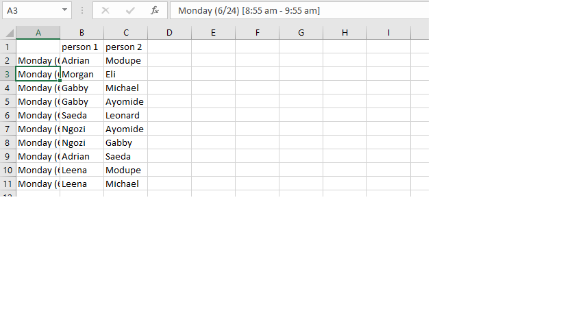

# GeneticScheduler
### Introduction and Problem:

Every week in the summer, the personel mannager at  a local coffeshop has to go through survey information on a spreadsheet where 14 or more people put their preferences (e.g "I want this shift", "I'm neutral about this shift", " I'd prefer not to work this shift", "I cannot work this shift"). She then takes the next two hours to try and come up with a schedule that fulfills as many of people's preferences as possible. Thus, making the schedule becomes a massive time suck for her when she could be using that precious time to take care of other responsibilities. 

### My approach:

When first thinking about this problem, I knew that there had to be a way to automate this with technology. I had just learned about genetic algorithms in my Program Design class and I felt that approach would be a great fit for this problem because there is no deterministic right answer(final schedule). All that is needed was something that was good enough. There is also some inherent notion of scoring or fitness in the problem as each person has preferences for shifts and the personel manager tried to find a schedule with as many people as possible getting their preference

### Result:

I went simple and made a schedule for one day but it can be used to make for a whole week as well. 

Below, I write how I decided to design everything and why.

## Design:

### Preprocessing:

My main mission here was to turn the text responses, indicating preference to numerical data which would be much easier to handle and use for evaluating the fitness of a schedule. 

I made it so "I want this shift" had a score of 4, "I'm neutral about this shift", a score of 3, " I'd prefer not to work this shift" -had a score of 2, "I cannot work this shift" had a score of 1.

I then turned the transformed the data into a json. 

**Before:**

 

**After:**

### Survey:

Code used to extract information from a survey json file.

**Creating a score Matrix:**

Created a scoring matrix where the rows are the names, the columns are each shift and at each entry is the preference score that the person gave for that shift. 

I utilized regular expressions to recognize what information was pointing to me a shift in the inputted json data. I was originally going to try using some type of error handling in the form of a "try" clause but that would have been a bit clunky in my opinion so I'm proud of myself for recognizing that I could use regular expressionsb instead as it is a bit more elegant.

The score matrix will be used later to calculate the fitness of any schedule candidate.

**Creating a name list:**

Created a list of the different employees that are working on a particular day

**Others:**

- Created a shift list of the shifts and put them in chronological order
- Used that shift list to create a mapping from an index to one of the shifts in order to represent each shift by a number.

### Schedule Agent Class:

This class represents a candidate for a schedule Agent. This class holds all the information to represent a survey class such as its fitness, number of shifts in the schedule, and the actual content of the schedule. There is also functionality to turn the schedule into a json itself. That json can then be used later to turn it into a csv file.

**Representation:**

Each schedule created will be represented as so:

[ {"Jay", "Gbenga", "Olumide"}, {"May", "Olumide", "Jay"}...] 

where the index of the array represents the shift and each set represents the people in each shift.

**Making a random schedule:**

I need to create a random schedule in the aforementioned format using some json data.

I have a list of names so I can just place three people in each shift with equal probability. And I do it immediately. 

**Calculating Fitness:**

Taking a relatively simple approach to calculating fitness. I'm going to look at the person at a certain shift and see what their preference score for that shift is ( 1-4) and then sum up all the preference scores at each shift. 

I use the scoring matrix to get the preference scores. 

The more 4s and 3s I get, the higher the score will be. 

I was also considering calculating fitness in the population class where I would compute each of the schedules in the population after the full population was created, but I decided against it because it made more intuitive sense for an instance of a schedule to calculate its own fitness once created. 

**Json Representation:**

{"person 1": {"Monday (6/24) [7:30 am - 8:55 am]": "Adrian", "Monday (6/24) [8:55 am - 9:55 am]": "Morgan ", "Monday (6/24) [9:55 am - 10:55 am]": "Gabby", "Monday (6/24) [10:55 am - 11:55 am]": "Gabby", "Monday (6/24) [11:55 am - 12:55 pm]": "Saeda", "Monday (6/24) [12:55 pm - 1:55 pm]": "Ngozi", "Monday (6/24) [1:55 pm - 2:55 pm]": "Ngozi", "Monday (6/24) [2:55 pm - 3:55 pm]": "Adrian", "Monday (6/24) [3:55 pm - 4:55 pm]": "Leena ", "Monday (6/24) [4:55 pm - close]": "Leena "}, "person 2": {"Monday (6/24) [7:30 am - 8:55 am]": "Modupe", "Monday (6/24) [8:55 am - 9:55 am]": "Eli", "Monday (6/24) [9:55 am - 10:55 am]": "Michael", "Monday (6/24) [10:55 am - 11:55 am]": "Ayomide", "Monday (6/24) [11:55 am - 12:55 pm]": "Leonard", "Monday (6/24) [12:55 pm - 1:55 pm]": "Ayomide", "Monday (6/24) [1:55 pm - 2:55 pm]": "Gabby", "Monday (6/24) [2:55 pm - 3:55 pm]": "Saeda", "Monday (6/24) [3:55 pm - 4:55 pm]": "Modupe", "Monday (6/24) [4:55 pm - close]": "Michael"}}

### Population Class:

## Possible Improvements:

- Add a more robust fitness computing algorithm that evaluates a schedule the same way a manager evaluates whether a schedule is good or not.
- More specific constraints of the business problem could be considered:
    - when crossbreeding or mutating. Like a person probably wouldn't like to work both an opening and a closing shift.
    - Could change the number of people on a shift based on busyness. In that case I may make  shifts into its own class with its own instances rather than just sets.

### How to run the code:

- to be written

### I learned or refreshed myself on:

- Regular Expressions
- Class Variables
- Pandas

###Project still in progress
